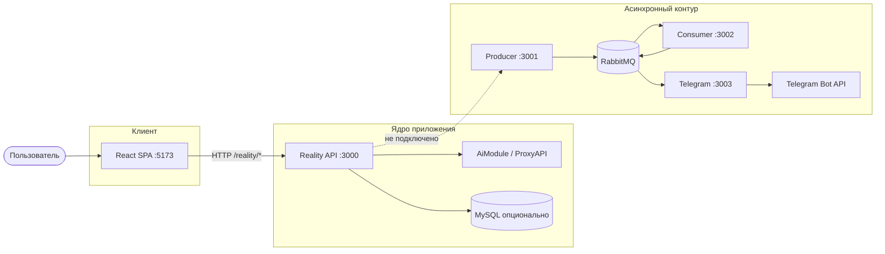
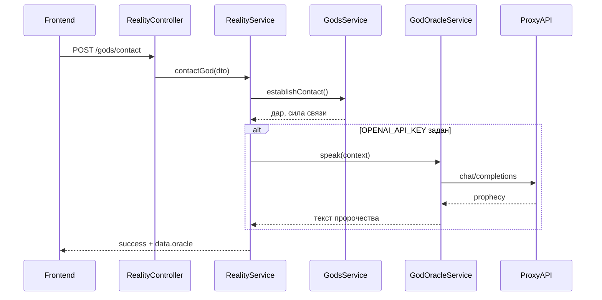

# Архитектура Magic13 (Slavic Reality System)

> Игрово-ритуальная платформа: REST API на NestJS, SPA на React, опционально — очередь событий и Telegram.  
> Аудитория документа: разработчики, которые подключают фронт, настраивают окружение или планируют интеграции.

---

## Содержание

1. [Кратко о системе](#1-кратко-о-системе)
2. [Контекст и границы](#2-контекст-и-границы)
3. [Быстрый старт](#3-быстрый-старт)
4. [Конфигурация](#4-конфигурация)
5. [Backend](#5-backend)
6. [Frontend](#6-frontend)
7. [ИИ-оракул](#7-ии-оракул)
8. [Пантеон (18 божеств)](#8-пантеон-18-божеств)
9. [Конвейер событий и Telegram](#9-конвейер-событий-и-telegram)
10. [Матрица возможностей](#10-матрица-возможностей)
11. [Дорожная карта](#11-дорожная-карта)
12. [Справочник путей](#12-справочник-путей)

---

## 1. Кратко о системе

| Компонент | Технология | Порт | Роль |
|-----------|------------|------|------|
| **Reality API** | NestJS | `3000` | Основная бизнес-логика: боги, ритуалы, регистрация, персонаж |
| **Frontend** | React + Vite + TypeScript | `5173` | UI: пантеон, контакт, ИИ-оракул, ритуалы |
| **Producer** | NestJS + RabbitMQ | `3001` | Публикация доменных событий |
| **Consumer** | NestJS + RabbitMQ | `3002` | Обработка событий → очередь уведомлений |
| **Telegram** | NestJS + Bot API | `3003` | Доставка уведомлений в чат |
| **RabbitMQ** | Docker image | `5672` / UI `15672` | Брокер сообщений |

**Важно:** фронтенд ходит только в Reality API. Messaging-стек живёт отдельно и **пока не вызывается** из `RealityService` при ритуалах или контактах.

---

## 2. Контекст и границы

### 2.1 Диаграмма контейнеров (C4, уровень 2)



### 2.2 Принципы разбиения

- **Reality API** — синхронные сценарии, валидация DTO, Swagger, единый префикс `/reality`.
- **`src/gods/`** — канон пантеона и логика контакта (подношение, дар, готовность).
- **`src/ai/`** — OpenAI-совместимый чат (ProxyAPI); не смешивается с игровой логикой богов.
- **Messaging** — чистая архитектура ports/adapters; E2E-тест в `src/e2e/`.

---

## 3. Быстрый старт

### 3.1 Минимальный сценарий (API + UI)

```bash
# Корень репозитория
cp .env.example .env
# Заполните OPENAI_* для оракула (см. раздел 4)

npm install
npm run start:dev          # Reality API → http://localhost:3000

# Второй терминал
npm run start:frontend     # UI → http://localhost:5173
```

- Swagger: [http://localhost:3000/api](http://localhost:3000/api)  
- В dev Vite проксирует `/reality` → `localhost:3000`.

### 3.2 Messaging (опционально)

```bash
docker compose up -d
npm run build
npm run start:producer:dev
npm run start:consumer:dev
npm run start:telegram:dev   # нужны TELEGRAM_BOT_TOKEN, TELEGRAM_CHAT_ID
```

### 3.3 Сборка

```bash
npm run build
npm run build:frontend
```

---

## 4. Конфигурация

Секреты хранятся в `.env` (файл в `.gitignore`). Шаблон — `.env.example`.

| Переменная | Обязательность | Назначение |
|------------|----------------|------------|
| `MYSQL_*` | Для регистрации в БД | Подключение Kysely/MySQL |
| `OPENAI_API_KEY` | Для ИИ-оракула | Ключ ProxyAPI / OpenAI |
| `OPENAI_BASE_URL` | Рекомендуется | База API, напр. `https://api.proxyapi.ru/openai/v1` |
| `OPENAI_MODEL` | Нет | Модель, по умолчанию `gpt-4o-mini` |
| `OPENAI_MAX_TOKENS` | Нет | Лимит ответа, по умолчанию `700` |
| `RABBITMQ_URL` | Для messaging | Строка подключения AMQP |
| `TELEGRAM_BOT_TOKEN`, `TELEGRAM_CHAT_ID` | Для Telegram-сервиса | Отправка уведомлений |
| `APP_BASE_URL` | Нет | База ссылок в письмах подтверждения email |

Без `OPENAI_API_KEY` контакт с богом работает, но поле `oracle` в ответе будет `null`; `POST /reality/gods/oracle` вернёт ошибку недоступности сервиса.

---

## 5. Backend

### 5.1 Структура каталогов

```
src/
├── main.ts                 # Bootstrap Reality API
├── reality/                # HTTP-слой и оркестрация
├── gods/                   # Пантеон + GodsService
├── ai/                     # OpenAI-совместимый оракул
├── bloodline/              # Пробуждение рода
├── balance/                # Точки Свет/Тьма
├── rituals/                # Ритуалы
├── database/               # MySQL (опционально)
├── producer|consumer|telegram/
├── shared/messaging/
└── e2e/
```

### 5.2 Reality API — группы эндпоинтов

Базовый путь: **`/reality`**.

#### Аутентификация и пользователи

| Метод | Путь | Назначение |
|-------|------|------------|
| `POST` | `/auth/register` | Регистрация, письмо с токеном |
| `GET` | `/auth/confirm-email?token=` | Подтверждение email |

#### Боги и ИИ

| Метод | Путь | Назначение |
|-------|------|------------|
| `GET` | `/gods` | Список пантеона + флаг `aiOracleEnabled` |
| `POST` | `/gods/contact` | Контакт: подношение, дар; при наличии ИИ — `oracle` в `data` |
| `POST` | `/gods/oracle` | Только пророчество LLM (без полного ритуала контакта) |

#### Игровая механика

| Метод | Путь | Назначение |
|-------|------|------------|
| `POST` | `/awaken-bloodline` | Пробуждение родовой линии |
| `POST` | `/balance/create` | Точка баланса |
| `POST` | `/rituals/perform` | Выполнение ритуала |
| `GET` | `/character/:id` | Профиль персонажа |
| `GET` | `/scenes/:act` | Сцены по акту |
| `PUT` | `/skills/upgrade` | Улучшение навыков |
| `GET` | `/status` | Статус системы |

### 5.3 Поток: контакт с богом + оракул



Источник правды о богах: `src/gods/slavic-gods.constants.ts` (`SLAVIC_GODS`, `SLAVIC_GOD_IDS`).

---

## 6. Frontend

### 6.1 Структура

```
frontend/src/
├── App.tsx                 # Состояние выбранного бога
├── config/constants.ts     # Навигация, типы ритуалов
├── data/gods.ts            # 18 божеств для UI
├── lib/api/                # HTTP-клиент, reality.api, formatContact
├── hooks/useFormSubmit.ts
├── components/
│   ├── layout/             # Header, Footer, фон
│   ├── brand/              # VelesSymbol
│   ├── gods/               # GodCard, GodSymbol
│   ├── sections/           # Hero, GodsGallery, формы, статус
│   └── ui/                 # Section, FormResult
└── styles/
```

### 6.2 Страницы и секции (якоря)

| Якорь | Компонент | API |
|-------|-----------|-----|
| `#gods` | `GodsGallery` | — (данные из `data/gods.ts`) |
| `#contact` | `ContactGodForm` | `POST /gods/contact` |
| `#oracle` | `GodOracleForm` | `POST /gods/oracle` |
| `#ritual` | `RitualForm` | `POST /rituals/perform` |
| `#register` | `RegisterForm` | `POST /auth/register` |
| `#status` | `SystemStatus` | `GET /status` |

Выбранный бог хранится в `App` и передаётся в Hero, галерею, контакт и оракул.

### 6.3 Соглашения

- Запросы через `lib/api/client.ts` (`apiRequest`).
- В dev базовый URL пустой — работает прокси Vite.
- Пророчество в форме контакта форматируется в `lib/api/formatContact.ts`.

---

## 7. ИИ-оракул

### 7.1 Модули

| Файл | Ответственность |
|------|-----------------|
| `ai/ai-config.service.ts` | Чтение `OPENAI_*` из `process.env` |
| `ai/openai-chat.service.ts` | `fetch` → `/chat/completions` |
| `ai/god-oracle.service.ts` | System prompt по профилю бога + намерение пользователя |

### 7.2 Поведение

- **Persona:** имя, сфера, стихия, символы и «голос» бога из констант; ответ на русском, стиль мифа.
- **Контакт:** оракул вызывается best-effort; при ошибке LLM контакт не отменяется, в лог пишется предупреждение.
- **Отдельный запрос:** `POST /gods/oracle` — только LLM, без проверки чистоты подношения в `GodsService`.

### 7.3 Пример тела запроса оракула

```json
{
  "godName": "veles",
  "intention": "что готовит мне путь в год змеи?",
  "userId": "vugar_guliev_1996",
  "offering": { "type": "мёд", "purity": 85, "significance": 90 }
}
```

---

## 8. Пантеон (18 божеств)

Идентификаторы API (`godName`) совпадают с ключами в `SLAVIC_GODS`.

| ID | Имя | Сфера |
|----|-----|--------|
| `veles` | Велес | Мудрость, магия |
| `perun` | Перун | Гром, война |
| `dazhbog` | Даждьбог | Солнце, изобилие |
| `mokosh` | Мокошь | Судьба, земля |
| `lada` | Лада | Любовь, гармония |
| `belobog` | Белобог | Свет, порядок |
| `chernobog` | Чернобог | Тьма, перемены |
| `vyshen` | Вышень | Высшая справедливость |
| `svarog` | Сварог | Небесная кузня |
| `stribog` | Стрибог | Ветры |
| `morana` | Морана | Зима, перерождение |
| `yarilo` | Ярило | Весна, плодородие |
| `rod` | Род | Предки |
| `simargl` | Симаргл | Небесный страж |
| `khors` | Хорс | Луна |
| `zorya` | Зоря | Заря |

Дублирование метаданных: backend (`slavic-gods.constants.ts`) и frontend (`data/gods.ts`) — осознанно для автономной сборки UI; при изменении пантеона обновляйте оба файла.

---

## 9. Конвейер событий и Telegram

### 9.1 Сервисы

| Сервис | Порт | Вход | Выход |
|--------|------|------|--------|
| Producer | 3001 | `POST /events` | Очередь событий RabbitMQ |
| Consumer | 3002 | Очередь событий | Очередь уведомлений |
| Telegram | 3003 | Очередь уведомлений | Telegram Bot API |

Паттерн: **ports & adapters** в `application/` и `infrastructure/adapters/`.

### 9.2 Docker Compose

`docker-compose.yml` поднимает RabbitMQ + producer + consumer + telegram.  
**Не входят:** Reality API, MySQL, frontend — запуск локально.

### 9.3 Интеграция с Reality (план)

После `gods/contact`, `rituals/perform`, `auth/register` публиковать `DomainEvent` в producer → consumer форматирует текст → telegram шлёт в чат. См. [дорожную карту](#11-дорожная-карта).

---

## 10. Матрица возможностей

| Возможность | Backend | Frontend | Примечание |
|-------------|:-------:|:--------:|------------|
| Пантеон 18 богов | ✅ | ✅ | `GET /gods`, галерея |
| Контакт с богом | ✅ | ✅ | Подношение, дар |
| ИИ-пророчество при контакте | ✅ | ✅ | Если задан `OPENAI_API_KEY` |
| ИИ-оракул отдельно | ✅ | ✅ | `POST /gods/oracle` |
| Ритуал | ✅ | ✅ | |
| Регистрация | ✅ | ✅ | |
| Статус системы | ✅ | ✅ | |
| Подтверждение email | ✅ | ❌ | Только API / ссылка из письма |
| Пробуждение крови | ✅ | ❌ | |
| Баланс Свет/Тьма | ✅ | ❌ | |
| Персонаж / сцены / навыки | ✅ | ❌ | Сюжет Вугара |
| События → Telegram | ✅ | — | Отдельный стек, не связан с Reality |

---

## 11. Дорожная карта

Приоритеты — ориентир, не жёсткий план.

### Высокий приоритет

1. **Reality → RabbitMQ** — события после контакта, ритуала, регистрации.  
2. **JWT и сессии** — после `confirm-email`, история в MySQL.  
3. **Rate limit и метрики** для `/gods/oracle` (защита ProxyAPI).

### Средний приоритет

4. **Telegram-бот** — команды `/status`, `/oracle`, `/ritual` поверх тех же use-case.  
5. **Совет по ритуалу через LLM** — отдельный prompt в `AiModule`.  
6. **Единый источник пантеона** — JSON или shared-пакет вместо двух TS-файлов.

### Низкий приоритет

7. **WebSocket/SSE** для `/status` — «пульс мироздания».  
8. **Docker Compose** — сервисы `reality`, `mysql`, `frontend`.  
9. **CI** — `nest build`, `frontend build`, `test:e2e` на messaging.

---

## 12. Справочник путей

| Что | Путь |
|-----|------|
| Точка входа API | `src/main.ts` |
| Контроллер Reality | `src/reality/reality.controller.ts` |
| Пантеон (backend) | `src/gods/slavic-gods.constants.ts` |
| ИИ | `src/ai/` |
| Пантеон (UI) | `frontend/src/data/gods.ts` |
| API-клиент | `frontend/src/lib/api/reality.api.ts` |
| E2E messaging | `src/e2e/producer-consumer-telegram.spec.ts` |
| Docker | `docker-compose.yml` |
| Шаблон env | `.env.example` |

---

*Документ отражает состояние репозитория Magic13Project. При добавлении сервисов обновляйте разделы 2, 5 и 10.*
