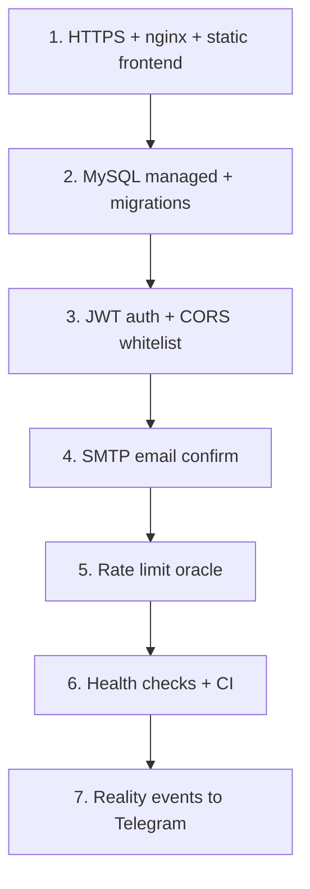

# Production Readiness — Magic13

Чеклист доработок перед выкладкой в продакшен. Статусы: **Готово** / **Частично** / **Нет**.

---

## 1. Сводка

| Область | Статус | Комментарий |
|---------|--------|-------------|
| Функциональность MVP | Частично | API + UI работают локально |
| Безопасность | Нет | Нет auth, открытый CORS, Swagger публичный |
| Персистентность | Частично | MySQL опциональна, auto-migrate в коде |
| Email | Нет | Ссылка только в логах |
| ИИ (ProxyAPI) | Частично | Работает, нет лимитов и учёта затрат |
| Messaging | Частично | Стек есть, не связан с Reality |
| Observability | Нет | Нет `/health`, метрик, трейсинга |
| CI/CD | Нет | Нет pipeline |
| Инфраструктура | Частично | Docker только для messaging |

**Вывод:** проект готов как **dev/demo**. Для production нужен блок работ по безопасности, инфраструктуре и интеграциям (см. разделы ниже).

---

## 2. Критично (блокеры продакшена)

### 2.1 Аутентификация и авторизация

| # | Задача | Сейчас |
|---|--------|--------|
| 1 | JWT / session после `confirm-email` | Все эндпоинты публичные |
| 2 | Защита `userId` — привязка к аккаунту, не произвольная строка | Любой может указать чужой `userId` |
| 3 | RBAC для админ-операций | Нет ролей |
| 4 | Rate limiting на `/gods/oracle` и `/gods/contact` | Нет — риск abuse и счёта ProxyAPI |

**Рекомендация:** `@nestjs/passport` + JWT, guard на мутациях; `throttler` на ИИ-эндпоинтах.

---

### 2.2 Безопасность HTTP

| # | Задача | Сейчас |
|---|--------|--------|
| 5 | CORS — whitelist origin вместо `origin: true` | `src/main.ts` |
| 6 | `helmet`, HTTPS-only cookies (если cookie-auth) | Нет |
| 7 | Отключить или защитить Swagger в prod | `/api` всегда открыт |
| 8 | Секреты — Vault / K8s secrets, не `.env` в образе | `.env` локально |
| 9 | Ротация `OPENAI_API_KEY` после утечки в чат/репо | Ручная |

---

### 2.3 Email и регистрация

| # | Задача | Сейчас |
|---|--------|--------|
| 10 | Реальный SMTP (SendGrid, SES, Mailgun) | URL в `logger.log` |
| 11 | HTML-шаблон письма + фронт-страница «email подтверждён» | Только API redirect |
| 12 | Политика паролей (сложность, bcrypt/scrypt с pepper) | scrypt есть, pepper нет |

---

### 2.4 Инфраструктура деплоя

| # | Задача | Сейчас |
|---|--------|--------|
| 13 | `docker-compose` / K8s: **reality + mysql + frontend + nginx** | Только RabbitMQ stack |
| 14 | Reverse proxy (nginx/Caddy): TLS, `/api` → backend, `/` → static | Нет |
| 15 | `GET /health` и `GET /ready` на Reality API | Только у microservices |
| 16 | Миграции БД (Flyway/Liquibase/Kysely migrations) | `createTable` в `onModuleInit` |
| 17 | `VITE_API_URL` в CI для production build фронта | Опционально в коде |

**Пример production topology:**

```
Internet → CDN/nginx (TLS)
            ├─ /          → frontend/dist (static)
            ├─ /reality   → reality:3000
            └─ /api-docs  → отключено или basic auth
```

---

## 3. Высокий приоритет

### 3.1 ИИ-оракул

| # | Задача |
|---|--------|
| 18 | Лимит запросов на пользователя/IP |
| 19 | Таймаут и retry с backoff к ProxyAPI |
| 20 | Логирование без PII (не логировать полные `intention` в prod) |
| 21 | Fallback-сообщение при недоступности LLM (уже частично на contact) |
| 22 | Мониторинг стоимости токенов / алерты |

---

### 3.2 Интеграция Reality ↔ Messaging

| # | Задача |
|---|--------|
| 23 | Публиковать `DomainEvent` после contact / ritual / register |
| 24 | Идемпотентность и DLQ для failed events (частично есть в consumer) |
| 25 | Единый формат уведомлений в Telegram |

---

### 3.3 Данные и консистентность

| # | Задача |
|---|--------|
| 26 | Единый источник пантеона (shared JSON / пакет) |
| 27 | Персистенция контактов и ритуалов в MySQL |
| 28 | Бэкапы MySQL, retention policy |
| 29 | Убрать/обезличить hardcoded PII в `GET /character/vugar_guliev` для публичного prod |

---

## 4. Средний приоритет

### 4.1 Frontend

| # | Задача |
|---|--------|
| 30 | Страница подтверждения email |
| 31 | Логин / профиль / история ритуалов |
| 32 | UI для остальных API (bloodline, balance, skills, scenes) |
| 33 | Error boundary, offline-состояние |
| 34 | SEO, meta, favicon уже есть |

---

### 4.2 Качество и эксплуатация

| # | Задача |
|---|--------|
| 35 | CI: `npm run build`, `npm run build:frontend`, `npm run test`, `test:e2e` |
| 36 | E2E для Reality API (supertest) |
| 37 | Structured logging (JSON), correlation id |
| 38 | Метрики Prometheus + дашборды |
| 39 | Sentry / аналог для ошибок |
| 40 | Версионирование API (`/v1/reality`) |

---

## 5. Низкий приоритет / улучшения

| # | Задача |
|---|--------|
| 41 | WebSocket/SSE для `/status` |
| 42 | Telegram-бот как второй клиент |
| 43 | RAG по текстам о славянской мифологии |
| 44 | i18n (сейчас только RU) |
| 45 | PWA, кэш статики на CDN |

---

## 6. Переменные окружения (production)

| Переменная | Prod |
|------------|------|
| `NODE_ENV` | `production` |
| `MYSQL_*` | Managed MySQL, сильные пароли |
| `APP_BASE_URL` | `https://your-domain.com` |
| `OPENAI_*` | Секреты из vault; лимиты на стороне ProxyAPI |
| `TELEGRAM_*` | Prod-бот, отдельный chat |
| `RABBITMQ_URL` | Кластер с auth, не `guest/guest` |
| `CORS_ORIGINS` | *(добавить в код)* список доменов |
| `JWT_SECRET` | *(добавить)* |
| `SMTP_*` | *(добавить)* |

Шаблон: `.env.example`.

---

## 7. Минимальный план выкладки (MVP prod)

Ориентир **2–4 недели** при фокусе на одном окружении.



### Неделя 1 — инфраструктура
- Docker compose prod: nginx, reality, mysql, frontend build
- Health endpoints, отключение Swagger
- `APP_BASE_URL`, `VITE_API_URL`

### Неделя 2 — безопасность и аккаунты
- JWT после confirm-email
- SMTP
- Throttler на oracle

### Неделя 3 — наблюдаемость и данные
- CI pipeline
- Логи + алерты
- Таблицы contacts/rituals

### Неделя 4 — интеграции
- Reality → RabbitMQ → Telegram
- Нагрузочное тестирование oracle
- Документация runbook для on-call

---

## 8. Команды для проверки перед релизом

```bash
# Сборка
npm run build
npm run build:frontend

# Тесты
npm run test
npm run test:e2e

# Smoke (API должен быть запущен)
curl -s http://localhost:3000/reality/status | jq .
curl -s http://localhost:3000/reality/gods | jq .count
```

---

## 9. Связанные документы

| Документ | Содержание |
|----------|------------|
| [ARCHITECTURE.md](./ARCHITECTURE.md) | Архитектура, диаграммы, пантеон |
| [API.md](./API.md) | Полная справка по эндпоинтам |
| [../readme.md](../readme.md) | Messaging stack, локальный запуск |
| [../.env.example](../.env.example) | Шаблон переменных |

---

*Обновляйте этот чеклист по мере закрытия пунктов — меняйте статус в разделе 1.*
